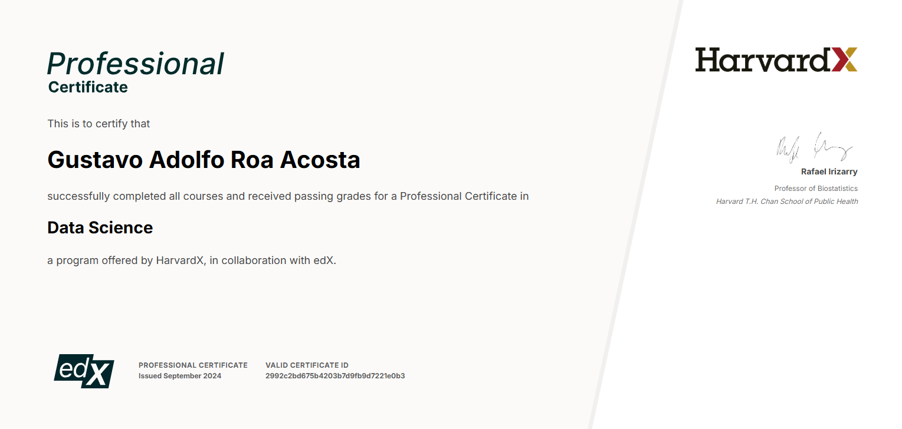

# 📊 HarvardX Professional Certificate in Data Science

This repository contains my personal notes, projects, and code developed throughout the **HarvardX Professional Certificate in Data Science**, offered by **Harvard University** on **edX**.  
**Graded assignments are excluded** to comply with the academic honor code.

## 🧠 Program Overview

The program provides a rigorous foundation in **R programming**, **statistics**, **machine learning**, and **data visualization**. It is designed to equip learners with the essential skills required for real-world data science practice.

🔗 Official program pages:  
- [HarvardX Data Science Certificate on edX](https://www.edx.org/professional-certificate/harvardx-data-science)  
- [HarvardX Course Series on Harvard](https://pll.harvard.edu/series/professional-certificate-data-science)

## 📚 Courses Included

1. **Data Science: R Basics**  
2. **Data Science: Visualization**  
3. **Data Science: Probability**  
4. **Data Science: Inference and Modeling**  
5. **Data Science: Productivity Tools**  
6. **Data Science: Wrangling**  
7. **Data Science: Linear Regression**  
8. **Data Science: Machine Learning**  
9. **Data Science: Capstone**

📄 [View My Verified Certificate](https://credentials.edx.org/credentials/2992c2bd675b4203b7d9fb9d7221e0b3/)

